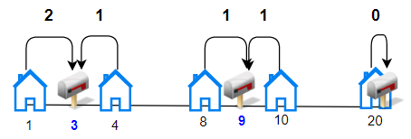

Given the array `houses` where `houses[i]` is the location of the `ith` house along a street and an integer `k`, allocate `k` mailboxes in the street.

Return *the* ***minimum*** *total distance between each house and its nearest mailbox.*

The test cases are generated so that the answer fits in a 32-bit integer.

 

**Example 1:**


```
Input: houses = [1,4,8,10,20], k = 3
Output: 5
Explanation: Allocate mailboxes in position 3, 9 and 20.
Minimum total distance from each houses to nearest mailboxes is |3-1| + |4-3| + |9-8| + |10-9| + |20-20| = 5 
```

**Example 2:**


```
Input: houses = [2,3,5,12,18], k = 2
Output: 9
Explanation: Allocate mailboxes in position 3 and 14.
Minimum total distance from each houses to nearest mailboxes is |2-3| + |3-3| + |5-3| + |12-14| + |18-14| = 9.
``` 

**Constraints:**
* `1 <= k <= houses.length <= 100`
* `1 <= houses[i] <= 10^4`
* All the integers of `houses` are **unique**.
